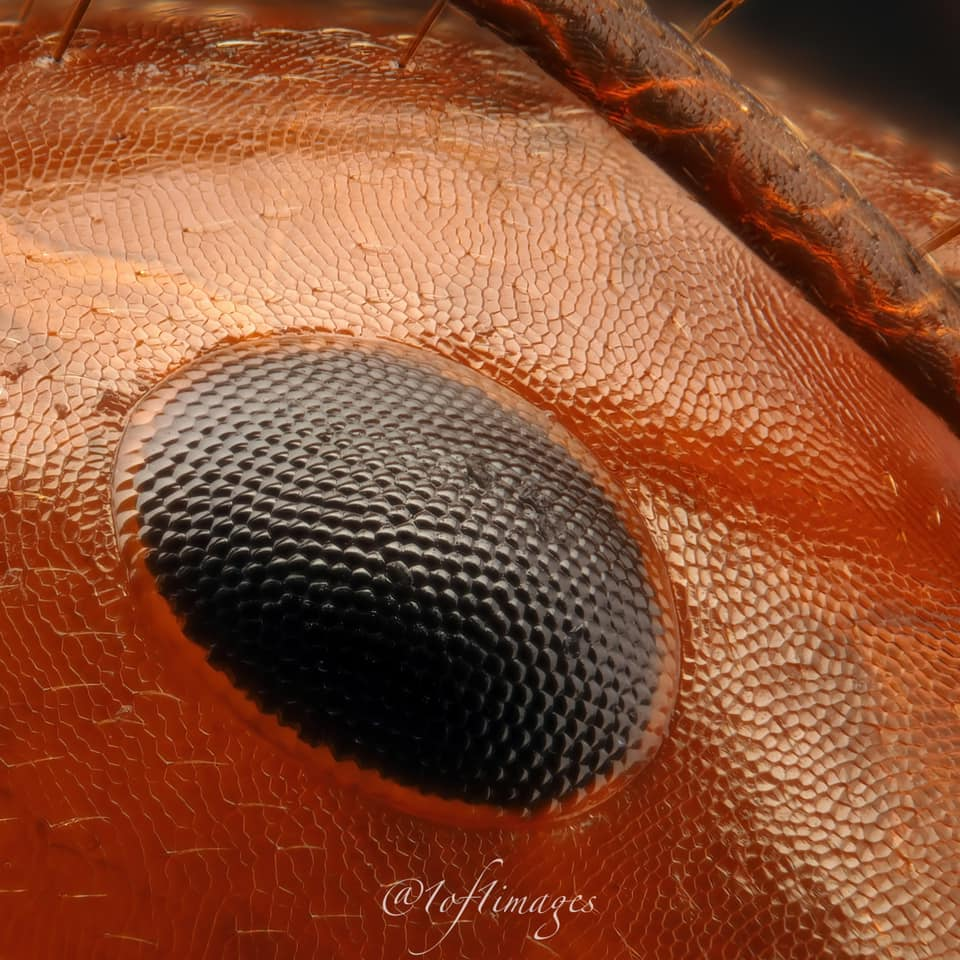

```{r setup, include=FALSE}
knitr::opts_chunk$set(echo = FALSE, message = FALSE, warning = FALSE)
```

### Howdy.

I am I Don Quijot- I uh... I mean Austen Miller Aceituna.

-Utah Valley University Biology Student

-Spanish-American

-Evil wizard

Here is [my resume](https://AMAceituna.github.io/Media/resume_website.pdf)

Here is [my CV](https://AMAceituna.github.io/Media/CVwebsite.pdf)

This is a cool picture of an ant's eye.

```{r, out.height=400, out.width=400}

```

Gorgeous!

Here's the mpg data set:
```{r}
library(tidyverse)
library(kableExtra)
library(plotly)

mpg %>%
  kable() %>%
  kable_classic(lightable_options = "hover") %>% 
  scroll_box(width = "500px", height = "200px")

p <- mpg %>% 
  ggplot(aes(x=displ,y=cyl)) +
  geom_smooth() +
  geom_point()

ggplotly(p)
  
```
<br><br><br>
The mean cty mpg is `r round(mean(mpg$cty),2)`


