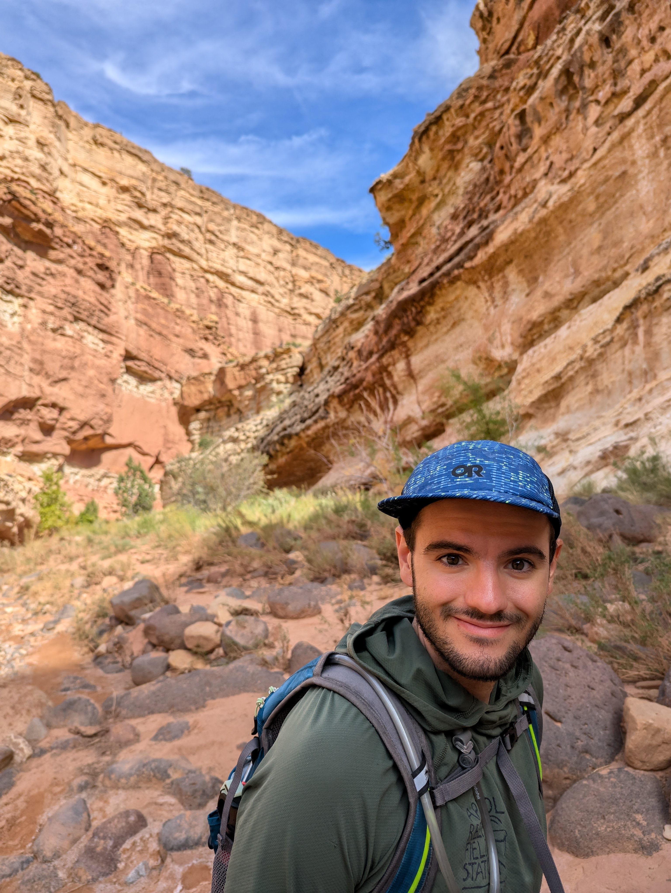
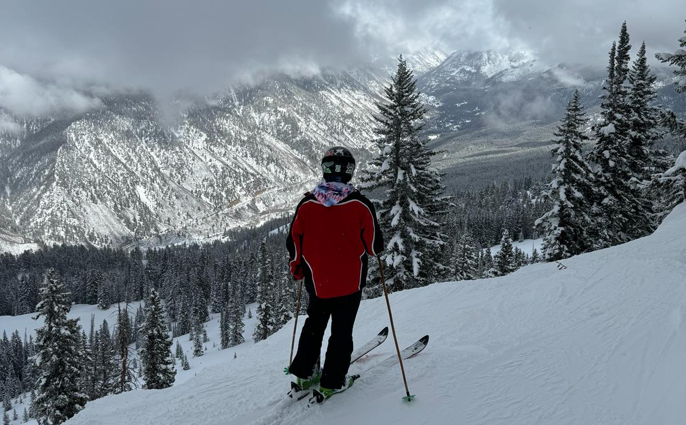

```{r setup, include=FALSE}
knitr::opts_chunk$set(echo = FALSE, message = FALSE, warning = FALSE)
```


<div style="overflow: auto;">
  
  <h1><strong>[My resume](https://AMAceituna.github.io/media/resume_website.pdf)</strong>  
  <strong>[My CV](https://AMAceituna.github.io/media/CVwebsite.pdf)</strong></h1>
  
  <h3>My name is Austen Miller Aceituna.
  
  (Austen Miller for Americans ;)
  
  I am a Bioinformatics major in the Honors program at Utah Valley University. I am interested in ecology, mycology, and plant microbiomes. I am currently a member of [Dr. Geoffrey Zahn's lab](https://gzahn.github.io/lab/).
  
  <br>
  
  I am a dual citizen of the United States and Spain, and I grew up between Utah and Madrid. I have spoken and read English (US) and Spanish (España) since I was a child, and I have been studying French and Portuguese as well.
  
  <br>
  
  In the recent past I spent two years working at the Utah State Mental Hospital after which I returned to university. I enrolled at Utah Valley University in the Spring 2022 semester where I became involved in the biology program. I spent the summer of 2022 living in Capitol Reef National Park, working in the field and archives as the cultural resource intern for the UVU Field Station. That Fall I was accepted as an NSF S-STEM Fellow and became a member of Dr. Zahn's lab. Since then I went on a biology/geology oriented study abroad to Sicily in summer 2023. Most recently I spent the summer of 2024 doing an REU at the University of Puerto Rico, Rio Piedras in the [lab](https://www.draimilcelab.com/) of Dra. Imilce Rodriguez-Fernandez!
  
  <br>
  
  I love books, art, cinema, and a variety of other humanities you can see in the literary activities tab.
  
  I also love spending time outdoors. My favorites are camping, hiking, and *especially* alpine skiing!


  
  
  Check out my [Instagram](https://www.instagram.com/chronicallyinclined/) for more!</h3>
  
</div>

<footer>
    <p><strong>austen.miller51@gmail.com<br>
  10741827@uvu.edu<strong/></p>
</footer>

