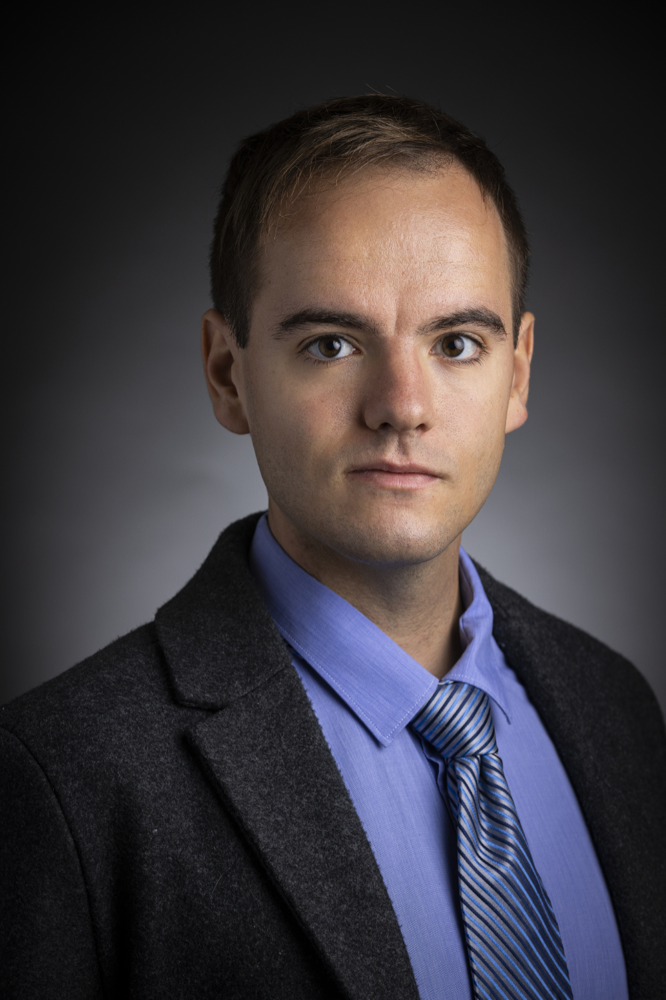

```{r setup, include=FALSE}
knitr::opts_chunk$set(echo = FALSE, message = FALSE, warning = FALSE)
```

<div style="overflow: auto;">
  

  <h2>[Home](https://amaceituna.github.io/)</h2>
  
  <h1><strong>[My resume](https://AMAceituna.github.io/Media/resume_website.pdf)</strong>  
  <strong>[My CV](https://AMAceituna.github.io/Media/CVwebsite.pdf)</strong></h1>
  
  <h3>My name is Austen Miller Aceituna.
  
  (Just Austen Miller for Americans ;)
  
  I am a Bioinformatics major in the Honors program at Utah Valley University. I am interested in ecology, mycology, and plant microbiomes. I am currently a member of [Dr. Geoffrey Zahn's lab](https://gzahn.github.io/lab/).  
  
  I am a dual citizen of the United States and Spain, and I grew up between Utah and Madrid. I speak English, Spanish (España), and am learning Portuguese (Brasil). I also enjoy alpine skiing and hiking. My favorite books are *Dune* by Frank Herbert and *Cien Años de Soledad* by Gabriel García Márquez.  
  
  I am a founder and the science content contributor for the “Philosophical Gym Bro” [Facebook](https://www.facebook.com/GymKingSadBoi/) & [Instagram](https://www.instagram.com/philosophicalgymbro/) meme page.</h3><br>

</div>


