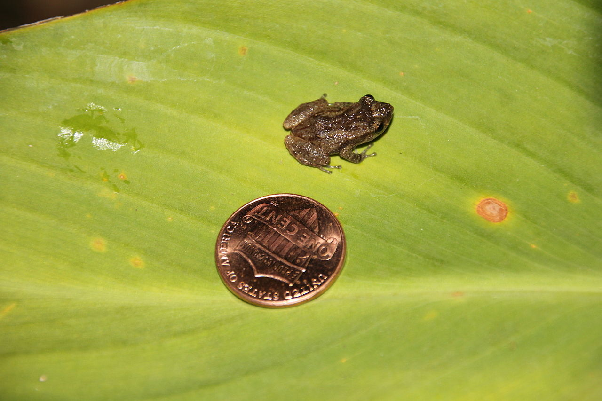
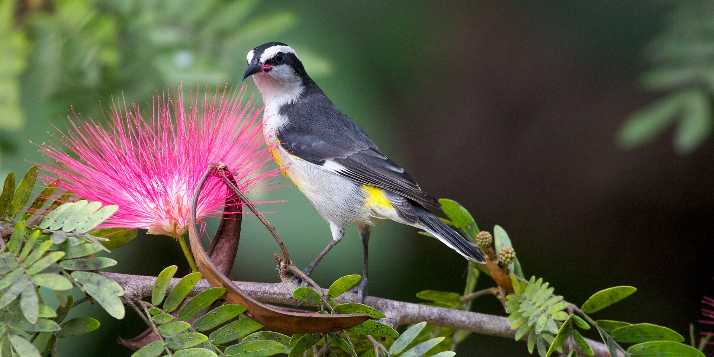
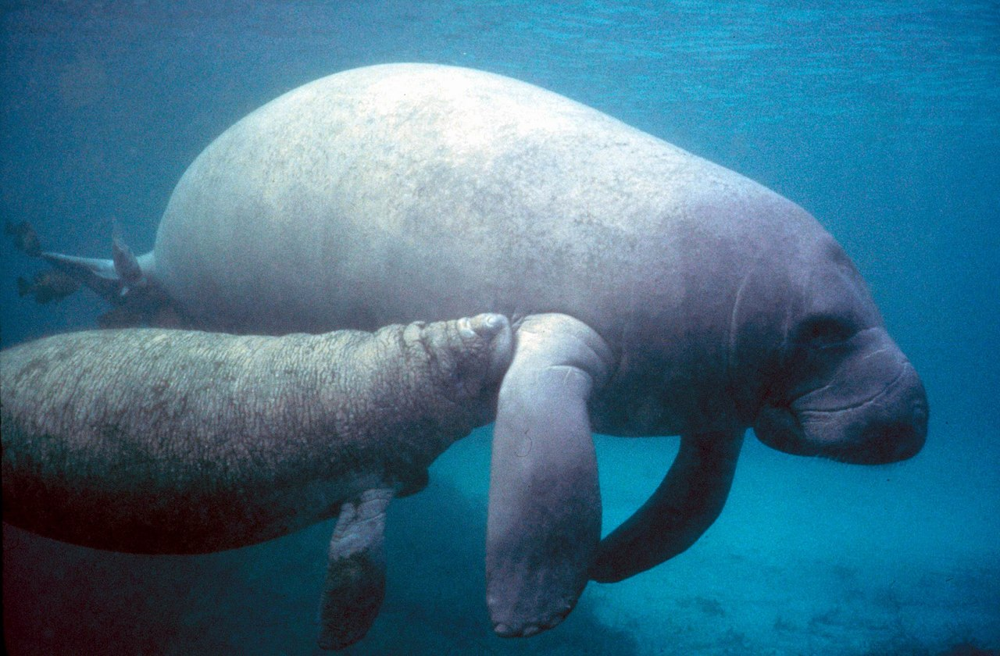

  

# Contents {.tabset}

(Images from Wikimedia Commons, or Diego)

## Reptiles
Full list of Reptiles [here](https://amaceituna.github.io/reptiles/) :

Puerto Rican Boa (<em>Epicrates inornatus</em>)

 

 

## Amphibians
List of amphibians [here]

Common Coquí (<em>Eleutherodactylus coqui</em>)

 

 

## Birds
List of birds [here]

Bananaquit (<em>Coereba flaveola</em>)

 

 

## Mammals
List of mammals [here]

Antillean Manatee (<em>Trichechus manatus</em>)

 

 

## Invasive Species
List of invasives [here]

- Spectacled Caiman (<em>Caiman crocodilus</em>)

 

 

