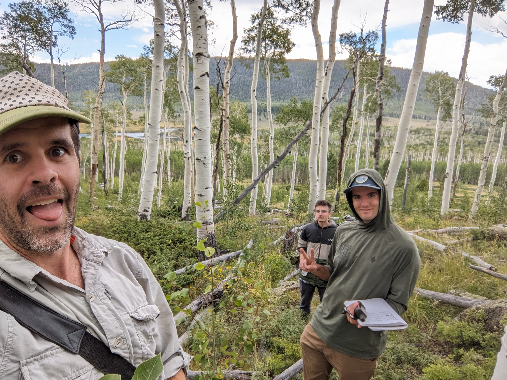

---
title:
---

```{r setup, include=FALSE}
knitr::opts_chunk$set(echo = FALSE, message = FALSE, warning = FALSE)
```
<br>

## Evaluating different methods to identify changes in the gut microbiota - lessons from alcohol-exposed Drosophila melanogaster
#### To be presented November 2024 at the Annual Biomedical Conference for Minoritized Scientists (ABRCMS) by lead author Jan Bilbao.
#### This project explores different methodologies to detect changes in the gut microbiota of Drosophila melanogaster exposed to alcohol. My contribution during the IQBIO 2024 REU at UPRRP involved writing and optimizing code in R to analyze and visualize diversity in ONT microbiome data, helping the team generate insights into the effects of alcohol on the gut microbiota.

<div>
  
  
</div>

<br>
<br>

## Spatial Dynamics of Foliar Fungal Community Structure in the Pando Aspen Clone
#### (Ongoing, but [here](https://www.friendsofpando.org/) is some more general information on Pando)
#### We are looking at the epiphytic and endophytic fungal communities of the the world's largest tree. We've collected samples from 2023 and 2024. 

<div>
  
  
</div>

<div>
  
  
</div>


<br>
<br>

## [BIOL 3100: Analysis of a Facebook Meme Page](https://amaceituna.github.io/projects/biol_3100)
#### Spring 2023, published in December 2023 [UVU Honors Journal](https://www.uvu.edu/untold/wings/philosophy.html)
```{r, out.width='70%'}
knitr::include_graphics("./media/newest.jpg")
```

<br>
<br>

<footer>
    <p><strong>austen.miller51@gmail.com<br>
  10741827@uvu.edu<strong/></p>
</footer>
