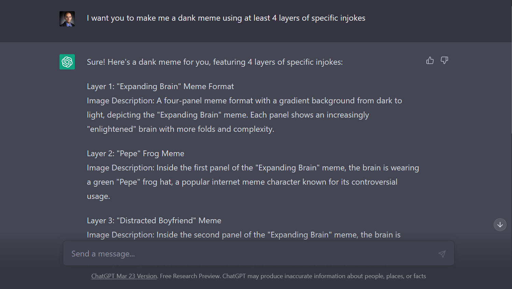

```{r setup, include=FALSE}
knitr::opts_chunk$set(echo = FALSE, warning = FALSE, message = FALSE)

library(tidyverse)
library(dplyr)
library(easystats)
library(modelr)
library(GGally)
library(lubridate)

dfyear <- read.csv("./dfyear.csv")
dfyear21 <- read.csv("./dfyear21.csv")
dfyear22 <- read.csv("./dfyear22.csv")
dfyear23 <- read.csv("./dfyear23.csv")
```
## [Home](https://amaceituna.github.io/)

# BIOL 3100 Final Project
```{r}

```


## Background

Several years ago, at the beginning of the COVID-19 Pandemic my friends and I started a Facebook meme page, [Philosophical Gym Bro](https://www.facebook.com/GymKingSadBoi). It was originally my friend Ben’s (a BYU Business/Stats major) idea, and he asked me and our other friend David (a UVU Philosophy/Psychology major) to help admin and produce content due to our shared interest in philosophy, science, literature, and other related topics. The idea behind this project is to analyze the data provided by the Meta business suite for our page. After a slow start we have had much more success than we ever anticipated. It was meant to be, and still is, a fun little intellectual meme page about whatever topics we were interested in at the time. It has since become a moderately sized entity in Facebook’s intellectual meme community. We just passed 10,000 followers in March.

The question I am most interested in exploring is about the importance of original content (OC). How successful is OC compared to shared content? Is it more likely to go viral? Most of the content on social media platforms is shared, not created. My original thought for this project was influenced by an article I once read that talked about how Tumblr had a 10:1 ratio of original content to shares. That was years ago, and I cannot find the article anymore. [Here's one](https://www.socialmediatoday.com/news/new-study-shows-that-25-of-twitter-users-produce-97-of-all-tweets/610146/) showing something similar going on with Twitter. The way memes have developed since 2016 make it seem like this is not news anymore. It is just the way that social media works now.

Within the Facebook meme community there is a certain importance placed on OC. Production of OC shows that a page is an actual producer of memetic content, which is:

1. Run by real humans.

2. Those humans have some amount of creativity, sense of humor, or insight.

For our purposes we are not interested in the degree of originality of memes. Obviously Kurzgesagt and True Facts are more original than someone making “Let’s Plays,” but we can’t easily quantify that. OC will here be defined as anything modified in some way by a human.


### Metrics:

Meta Business Suite is the interface through which Facebook’s pages are run. Zuckerberg being a benevolent and generous ruler, we have access to statistical data about our own page through the Insights tab of this interface.

Some relevant information about these metrics:

* I will be using [this website](https://www.socialstatus.io/facebook-metrics/) as a reference for how Meta defines its metrics.

* We do not pay to promote any of our content. This page has always been for creativity and fun. All this data can be considered "*organic*".

* We don’t make videos/stories/reels which simplifies things. The data from Meta only represents Facebook because that is where we are active. There is no way to track memes being stolen or copy/pasted to other social media sites. I am going to completely ignore this quite common user practice, despite its obvious relevance to analyzing memetic virality. Edit Oct 2023: Since this analysis we have expanded to Instagram(link) which is also managed from Meta Business Suite.

* Some metrics have the same names as similar metrics addressing the performance of pages as a whole. I’m interested in individual posts, so the metrics of this analysis are on the post level.

* I will be using *impressions* instead of *reach*. In measuring the “*virality*” of posts, impressions are more useful because, as a measure of unique users, reach is not accounting for memes being seen multiple times by the same user. Seeing something time and time again means users are more likely to engage with the meme, or some mutation of it they particularly like. Users are also more likely to reference the meme in conversation, their own posts, or even make mutations themselves. Although less interesting from a page admin standpoint, impressions is a better metric for showing social media *zeitgeist* relevance.

* Engagement is also an important metric. It is a combination of all direct interaction with a post (clicks, likes/reactions, comments, shares, etc.) Shares is the most interesting because it shows that a user liked the post enough to share it in a post associated with their account. Each share represents a new set of users exposed to the post.

Edit: Meta’s new update lets you download data relative to the day posts were made. That is interesting, but I will continue to use what I have. Many posts are not instantly successful (Ex. they might take off only once shared to a certain group). Total data is better for the things relevant to this project.


## The Data

I'm going to be looking at the data for our page over the course of 2022. During this time all three admins were engaged with the page and creating OC consistently. We even had a few things go viral. Seeing your memes showing up in totally random places is incredibly validating. The page was already about 2 years old and had started to have some success but was also quickly growing. This will provide a large data set, while also avoiding the odd statistics you can get at the very beginning of such projects.

The data provided by Meta has some annoying aspects to it. Let's get to cleaning.

My Facebook and Meta Business Suite interfaces are in Spanish and so is the data. This is because I set a lot of my UIs to Spanish so I can continually practice my first language. I am fluent, but I don't necessarily know what words/phrases correspond to what in English. Tech vocab is often not a direct translation. There are also occasionally words from Latin American Spanish which I don't recognize, or which may be used differently in those dialects. An even larger problem is vowels with tildes "`". I typically ignore these letters when typing in Spanish (a terrible, yet relatively common practice on the Spanish internet). Five extra letters in the alphabet means that column names cannot be referred to accurately in code.

Business Suite's Insights tab gives data in .csv format. That's good for R, but it only lets you download three months at a time. So, we have four raw uncleaned .csv files representing all the page's posts over the course of 2022. A single dataframe will be much easier to work with.

Edit: I have added data from 2021 and 2023 (through April 30) to the analysis in order to widen the set and be able to use the seasonality functions in [Facebook's Prophet package](https://facebook.github.io/prophet/). 


### The Tidying Process:

1. Read in .csv files

All four have 34 variables, so no trouble with mismatched variable columns.

Edit: The 2021 and 2023 .csvs did not have 34 and I had to go through select() before rbind() to make them place nice.

2. Clean names

Gets rid of the tildes, capitalization, added underscores. The names are now code friendly.

3. Append

We need a single datafram, so used rbind() to append all the observations together.

4. Select()

Most of those 34 variables Meta gave are irrelevant or empty. We'll keep the ones that have data, but what’s important is impressions, engagement, and shares. I was also able to change the order of columns to make more sense too.

I also translated the column names into English. Some post descriptions are still in Spanish, but we don't care about those.

5. Separate date_hour variable

The date and time of each post are different variables for this analysis but are stuck together as one column and need to be split.

The date and time also had to be changed to POSIX format using as.POSIXct()

The class of time is still stuck as a character. Trying with as.POSIX() forces it to add on a date (today's by default). It shouldn’t be a problem unless the time of day becomes relevant. 

6. New Variable: OC

We mark our original posts with the term "OC" (or some variation including capitals, periods, spaces, or all those things mixed) in their descriptions to indicate original content, so we are going to need to make a new column based on the post descriptions. We can get a variable for what is or isn't OC using unique() and grep().

7. New Variable: weekday

The weekly distribution of posts may have some impact. The weekdays() function is quite useful for adding a new variable for which day of the week something was posted on. The days of the week were in alphabetical order, but as.factor and set levels set them straight.


### The Dataframes:

What we're left with is a single tidy dataframe with 693 observations across 18 variables.

That means a total of 693 posts in 2022. Even between three admins an original meme every day is a lot. 101/693 posts are OC in the new column. That means we have been posting about twice a day and an original meme about twice a week.

Edit: The full data frame for all three years has 1490 observations. 245/1490 posts are marked as isOC = TRUE. This holds quite closely to the trend in the 2022 data.

There are likely some false negatives. I have only had time to manually fix important outliers. There should be a diminishingly small number of false negatives, including only those posts which we forgot to mark  with OC when they were originally made.


```{r}
library(kableExtra)
dfyear <- read.csv("./dfyear.csv")
kable(dfyear,caption = "Jan 1st 2021 - Apr 30 2023", col.names = names(dfyear), align = "llcccccccccccccr") %>% 
  kable_styling("striped") %>%
  scroll_box(height = "300px", width = "100%")
```


```{r}
library(tidyverse)
library(GGally)

dfyear <- read.csv("./dfyear.csv")

dfyear %>%
  select(impressions,engagements,reach, shares) %>% 
  ggpairs() +
  theme(axis.text.x = element_text(angle = 90))
```

It looks like there are three outliers consistently messing with things. Those must represent posts that went quite viral. It looks like there is a cluster of five or so posts that were highly successful as well sitting behind them, but ahead of the pack.


### Numbers:

Let's get a sense of the overall scale of the page.

```{r echo=TRUE}
dfyear$impressions %>% sum()
dfyear$engagements %>% sum()
dfyear$shares %>% sum()
```

Since Jan 2021 that's:

* 2.8 million impressions

* 103 thousand engagements

* 12 thousand shares

Here we’ll get a better look at those top viral posts. I want to see what is doing best at doing best.
I'm arbitrarily setting the *viral* cutoff as multiples of 10 which leave a top ~1% of the observations for that metric. 

```{r echo = TRUE}
topimp <- dfyear %>% filter(impressions >= 10000)
topeng <- dfyear %>% filter(engagements >= 1000)

topimp %>% count()
topimp %>% filter(isOc == TRUE) %>% 
  count()

topeng %>% count()
topeng %>% filter(isOc == TRUE) %>% 
  count()
```

We can see here that the top posts are disproportionately likely to be OC compared to the rest of the observations.
Of the posts with impressions that are > 10,000, 15/26 are OC. Of those with engagements that are > 1000, 5/7 are OC.

This supports the idea that OC particularly appeals to the page's audience members who are more active and more likely to interact with content.

With this full tidy data set we can already get some insight.

```{r echo = TRUE}
dfyear %>% 
  group_by(isOc) %>% 
  summarize(count=n(), mean(impressions), median(impressions), sd(impressions))

dfyear %>% 
  group_by(isOc) %>% 
  summarize(count=n(), mean(shares), median(shares), sd(shares))

dfyear %>% 
  group_by(isOc) %>% 
  summarize(count=n(), mean(engagements), median(engagements), sd(engagements))
```

This tells us that OC is indeed performing better than shared content across multiple metrics. 

This is all very numbers. Now let's do some not numbers.


## Figures

I am going to be using log10() for most things because virality works through exponential spread. To help get a sense of the scale we're working with and why I'm doing it like this, here is a terrible figure showing the distribution of impressions without a log scale:

```{r}
dfyear <- read.csv("./dfyear.csv")

dfyear %>% 
  ggplot(aes(x = impressions,color = isOc)) +
  geom_histogram(binwidth = 500) +
  theme_light() +
  theme(axis.text.x = element_text(angle = 0)) +
  labs(x = "Impressions",
       y = "# of Posts")
```


### Histograms:

Some histograms of the full data set using log10(impressions) and log10(engagements).
I.e. the same figure, but not terrible.

```{r}
dfyear %>% 
  ggplot(aes(x = log10(impressions),color = isOc)) +
  geom_histogram() +
  theme_light() +
  theme(axis.text.x = element_text(angle = 0)) +
  labs(x = "Log10(Impressions)",
       y = "# of Posts")
```

```{r}
dfyear %>% 
  ggplot(aes(x = log10(engagements),color = isOc)) +
  geom_histogram() +
  theme_light() +
  theme(axis.text.x = element_text(angle = 0)) +
  labs(x = "Log10(Engagements)",
       y = "# of Posts")
```


Very cool. We have a bit of a bimodal distribution here. That’s probably from the explosive growth the page had in 2021. It seems like the algorithmic reach of the page was expanding so fast that it skipped right over the 10^2 range.


### Weekday Distribution:

Now I have also become curious about the distribution of posts across the days of the week.

```{r}
# Histogram of our '21 and '22 posts based on day of the week to compare.
dfyear$weekday <- as.factor(dfyear$weekday)
dfyear$weekday <- factor(dfyear$weekday, levels=c('Sunday', 'Monday', 'Tuesday', 'Wednesday',
                                              'Thursday', 'Friday', 'Saturday'))

dfyear %>% 
  ggplot(aes(x = weekday, color = isOc)) +
  geom_histogram(stat="count") +
  theme_light() +
  theme(axis.text.x = element_text(angle = 90)) +
  labs(title = "2021-2023 Weekday Post Spread") +
  labs(x = "Weekday",
       y = "# of Posts")

# 2023 Histogram
dfyear23$weekday <- as.factor(dfyear23$weekday)
dfyear23$weekday <- factor(dfyear23$weekday, levels=c('Sunday', 'Monday', 'Tuesday', 'Wednesday',
                                                      'Thursday', 'Friday', 'Saturday'))

dfyear23 %>% 
  ggplot(aes(x = weekday, color = isOc)) +
  geom_histogram(stat="count") +
  theme_light() +
  theme(axis.text.x = element_text(angle = 90)) +
  labs(title = "2023 Weekday Post Spread") +
  labs(x = "Weekday",
       y = "# of Posts")
```

This weekday distribution is interesting. I left out 2021 and 2022 because they are not particularly interesting, but 2023 compared to the overall data is neat. It tracks my own Facebook usage because all the admins had very different schedules in spring, and I'm the one who shares the most. Wednesday and Sunday were the days I had the most time to study that semester followed by Tuesday and Thursday. I often take study breaks where I browse Facebook. Not enough time to make memes (hence less OC those days), but enough to share (hence more posts). 


### Prophet:

I would like to see how seasonality affects post performance. Facebook created the Prophet package for just this sort of thing. It makes seasonal forecast models for data sets just like this one. This is interesting because I could see it going either way. Maybe winter doesn't matter to our performance, or maybe it matters a lot. I would have liked to test particular holidays (Prophet has a very cool data set with worldwide holidays until 2044), but our audience demographics are too globalized to meaningfully analyze particular holidays.

Here is the forecast for impressions.

```{r}
library(prophet)

Pdfyear <- dfyear
Pdfyear$ds <- Pdfyear$date
Pdfyear$y <- log10(Pdfyear$impressions)
P <- Pdfyear %>% 
  prophet(yearly.seasonality = TRUE)
  
futureP <- make_future_dataframe(P, periods = 365)

forecastP <- predict(P, futureP)

plot(P,forecastP,
     ylabel = "Log10(Impressions)",
     xlabel = "Date")

prophet_plot_components(P, forecastP)
```

I really wish I had the next month's worth of data to see if the yearly May spike is real, or if Prophet is getting veered off course by the 2021 growth spurt.

And now for engagements.

```{r}
Pdfyeareng <- dfyear
Pdfyeareng$ds <- Pdfyeareng$date
Pdfyeareng$y <- log10(Pdfyear$engagements + 1)
  # Had to add 1 for the log to not freak out at 0 values.
Peng <- Pdfyeareng %>% 
  prophet(yearly.seasonality = TRUE)

futureE <- make_future_dataframe(Peng, periods = 365)

forecastE <- predict(Peng, futureE)

plot(Peng,forecastE,
     ylabel = "Log10(Engagements)",
     xlabel = "Date")

prophet_plot_components(Peng, forecastE)
```

Prophet's seasonality can be turned on and off. It does not seem like engagement is particularly affected by the season. Here is the non-seasonal version to compare.

```{r}
Pdfyeareng <- dfyear
Pdfyeareng$ds <- Pdfyeareng$date
Pdfyeareng$y <- log10(Pdfyear$engagements + 1)
  # Had to add 1 for the log to not freak out at 0 values.
Peng <- Pdfyeareng %>% 
  prophet(yearly.seasonality = FALSE)

futureE <- make_future_dataframe(Peng, periods = 365)

forecastE <- predict(Peng, futureE)

plot(Peng,forecastE,
     ylabel = "Log10(Engagements)",
     xlabel = "Date")
```

I am holding off judgement on seasonality for impressions. The graphs are more different than engagements was. Further, engagements may reflect the activity of a more dedicated kind of social medial user who is less affected by seasonality (I’m not a Facebook addict, you’re a Facebook addict!) Most users are instead "lurkers" who do not actively interact with content. Impressions being non-unique views, they may be more affected by the impact of seasonality on lurkers.


## Conclusions

* ~~I spend too much time on social media.~~

* Original content is much more likely to become viral.
  + According to some quick math, it is about 6.8x more likely to go viral than shared content.


* The page's audience cares about what the page produces.
  + Engagement is higher on original content, which means the page's audience is interested enough in the original content the page is creating to interact with it.


* The trend of the page's success is related to the admins' level of engagement with the page.

* Seasonality doesn't seem to matter very much to engagement, and therefore active Facebook usage (among our audience at least).


## Acknowledgements

Mark Zuckerberg:
For stealing Facebook and turning it into the juggernaut that it is today.

Dr. Geoffrey Zahn:
For teaching me how to create this monstrosity.

Benjamin Cardon and David Maxwell:
For being my best friends and brothers in memeage. Additionally, to Ben for giving so much help, advice, and enthusiasm with this project. Weird energy is never unwelcome.

And a sneak peek at our next post:
```{r}
knitr::include_graphics("../media/newest.jpg")
```


### I Have No Mouth and I Must Meme:

A tangent

It seems like AI is going to have a very strange effect on online communities. The potential for AI generated memes and art certainly informed the focus of this analysis on original human-made content. Memetic spread has often been based on references heaped on in-jokes heaped on references. Now that AI can already generate its own memes, the value of incredibly topic specific memes that only humans can make may gain importance.

Edit: I checked out ChatGPT's meme mastery. This is troubling.

```{r}

knitr::include_graphics("../media/gpt2.png")
```

Not only does this meme work, but it's meta. More importantly it's funny. These are, however, easy references using some of the most common meme formats. It is still quite worrying. Forget about automating jobs away, what will we do when the beep-boops are funnier than us?

