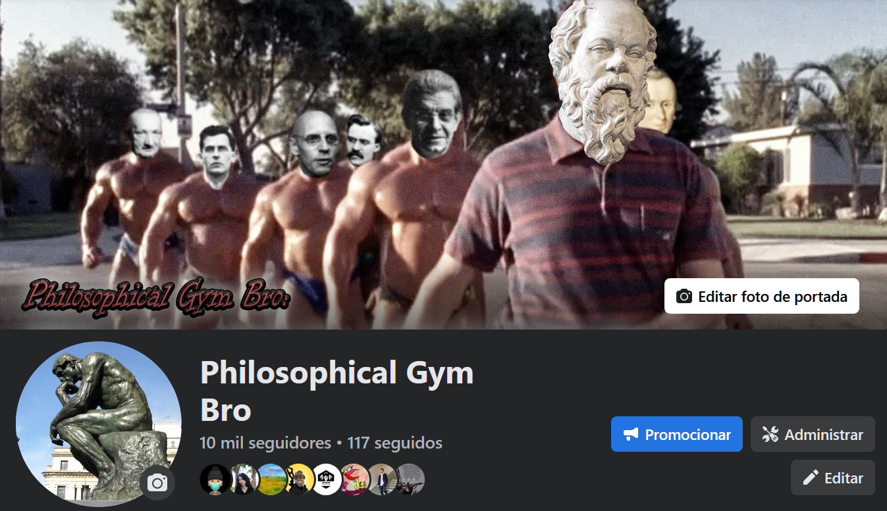
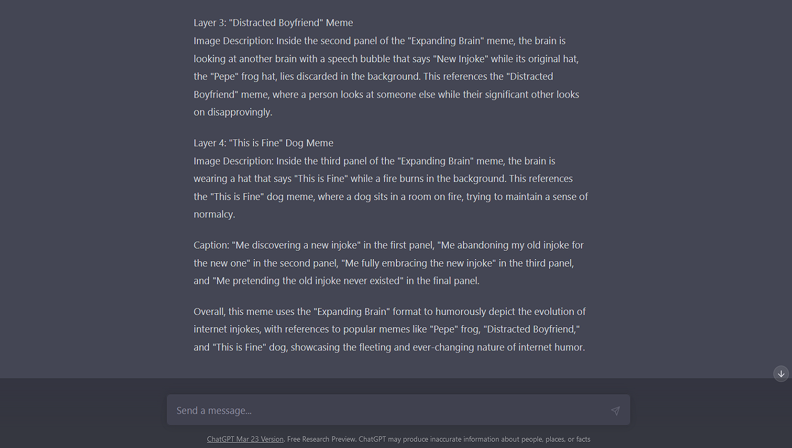

```{r setup, include=FALSE}
knitr::opts_chunk$set(echo = FALSE, Warning = FALSE, Message = FALSE)
```

# BIO 3100 Final Project
```{r}

```


## Background:

Several years ago I started a Facebook meme page, [Philosophical Gym Bro](https://www.facebook.com/GymKingSadBoi) (I didn't pick the name) with my friends Ben and David, a BYU Business/Stats major and a UVU Philosophy/Psychology major. The idea behind this project is to analyze the data provided by the Meta business suite for the page. After a slow start we have had much more success than we ever anticipated. It was meant to be, and still is, a fun little intellectual meme page about whatever topics we were interested in at the time. It has since become a moderately sized entity in Facebook's intellectual meme community. We just passed 10,000 followers in March.

The question I am most interested in exploring is about the importance of original content. How much more successful is OC in general? How much more likely is it to go viral? Most of the content on almost any social media platform is re-shares/re-posts. My original thought for this project was influenced by an article I once read that talked about how a website (Tumblr, I think) had a 10:1 ratio of original content to re-shares. That was years ago and I can't find the article anymore, but [here's one](https://www.socialmediatoday.com/news/new-study-shows-that-25-of-twitter-users-produce-97-of-all-tweets/610146/) showing something similar going on with Twitter. The way memetics have developed since 2015 or so make it seem like this isn't news anymore. It's just the way that social media works now.

Within the Facebook meme community there is a certain importance placed on original content (OC) produced by pages. Production of OC shows that a page is an actual producer of memetic content, which is:

1. Run by actual humans.

2. Those humans have some amount of creativity, sense of humor, insight, etc.

For our purposes we are not interested in levels of originality in OC. Obviously Kurzgesagt and True Facts are more original and respectable than someone making let's plays, but we can't easily quantify that. OC will here be defined as anything modified in some way by a human.

### AI Tangent:

It had not occured to me earlier, but AI is going to have a very strange effect on these communities. Memetic spread has often been based on references heaped on injokes heaped on references. Now that AI can already generate its own memes, the value of incredibly topic specific memes that only humans can make will gain a lot of importance.

Edit: This is troubling.

```{r}
knitr::include_graphics("../Media/gpt1.png")

```

Not only does this work, but it's meta and more importantly funny. These are, however, easy references using some of the most common meme formats. Still quite worrying. Forget about automating our jobs away, what will we do when the beep-boops are funnier than us? I have no mouth and I must meme.

## Metrics:

Meta Business Suite is the interface through which Facebook's pages are run. Zuckerberg being a benevolent and generous ruler, we have access to statistical data about our own page through the Insights tab of this interface. The most detailed data we have access to is the performance metrics of our own past posts. Some of these metrics have the same names as similar metrics addressing performance of pages as a whole. For example, "Reach" can mean total reach of page over a certain period, or the total reach achevied by a single post. I'm interested in the specific data of individual posts, so unless stated otherwise, metrics are on the post level.

Also important is the fact that we do not pay to promote any of our content. This page has always been for creativity and fun. All these metrics can be considered "*organic*".
We do not make videos/stories/reels which helps simplify things. We are only active on Facebook (although have been meaning to make an Instagram), so the Meta metrics only represent one website.

I don't perfectly understand how all of Meta's metrics are calculated. I will be using [this website](https://www.socialstatus.io/facebook-metrics/) as a reference.

In measuring the "*virality*" of posts, Impressions seems more important than Reach. I had not heard of Impressions before this, and Reach is often talked about as the gold standard. This may be a recent update. Facebook only started using Meta Business Suite about two years ago and has been constantly changing it since (While writing this I saw a notification for yet another update). Impressions seems more useful because, as a measure of unique users, Reach is not accounting for users who see certain memes over and over, making them more likely to engage with some mutation they particularly like and reference the memes in conversation or their own posts. Although less interesting from a page admin standpoint, Impressions is better at showing social media *zeitgeist* relevance. 

Engagement is also very important. It is essentially a combination of all interaction with a post (clicks, likes/reactions, comments, shares, etc.) The importance of these sub-metrics is something like clicks < reactions < comments < shares. Shares is the most interesting because it shows both that a user liked the post enough to associate it with their account, and each share represents a new set of users exposed to the post. So shares indicate *virality* far far better than the other engagement sub-metrics.

## The Data:

I'm going to be looking at the data for our page over the course of 2022. During this time all three of us admins were engaged with the page and creating OC fairly consistently. We even had a few things go viral. Seeing your memes showing up in totally random places is so incredibly validating (there's no way to track meme theft, so we're going to completely ignore it). The page was already about 2 years old and had started to have some success, but was also quickly growing. This will provide a large data set, while also avoiding the odd statistics you can get at the very beginning of such projects.

The data provided by Meta has some annoying aspects to it. Let's get to cleaning.

My Facebook is in Spanish. This is my own fault because I set a lot of my UIs to Spain Spanish so I'm continually practicing. I am fluent, but I don't necessarily know what words/phrases correspond to what in Anglo-ish. Tech vocab is often not a direct translation. There are also occasionally words from Mexican or South American Spanish which I don't always recognize, or familiar words are used differently.

Ex. I just figured out that "*interacciones*" is engagements, not interactions. A close, but not quite direct translation.

An even larger problem is the fact of vowels with tildes(`). I have no clue how to write those on an English keyboard (I usually just write the word wrong typing in Spanish). Five extra letters in the alphabet are going to mess things up if the column names can't be referred to accurately.

Business Suite's Insights tab gives data in .csv format. That's good, but it only lets you download three months at a time. So we have four raw uncleaned .csvs representing all the page's posts over the course of 2022 split into quarters. A single dataframe would be much easier to work with.

### Cleaning:

The tidying process:

1. Read in .csvs

All four have 34 variables, so no trouble there.

2. Clean names

Gets rid of the tildes, capitalization, added underscores.

3. Append

We need a single df, so rbind appends all the observations together.

4. Select()

Most of those 34 variables Meta gave us are irrelevant or empty. We'll keep what has data, but even some of those probably aren't critical for us. Change order of columns to be a little less annoying too.

5. Separate date_hour

The date and time of of each post are different variables, both of which will likely be important.

The class of these two columns is still stuck on character and as.Date() is not cooperating. Will edit when problem fixed.

6. New Variable: OC

We mark our original posts with "OC" (or some variation) in their descriptions, so we are going to need to mutate a new column based on the post descriptions. Unique() might help, but practically every description is unique.

### 2022 Data Frame

What we're left with is a single tidy df with 693 observations across 18 variables.

That means as total of 693 posts. Even between three admins an original meme every day is a lot, so right off the bat you know that OC:shares is almost certainly not 1:1.


