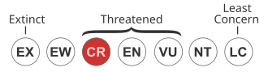
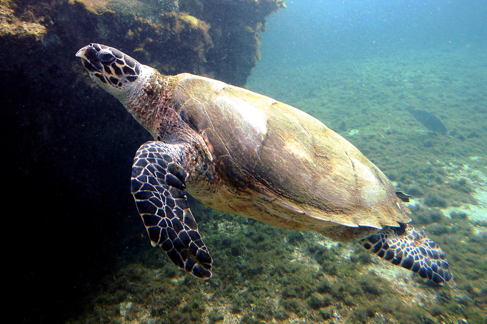
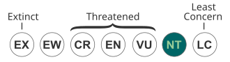
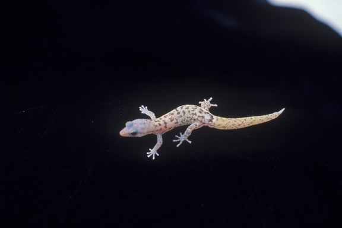
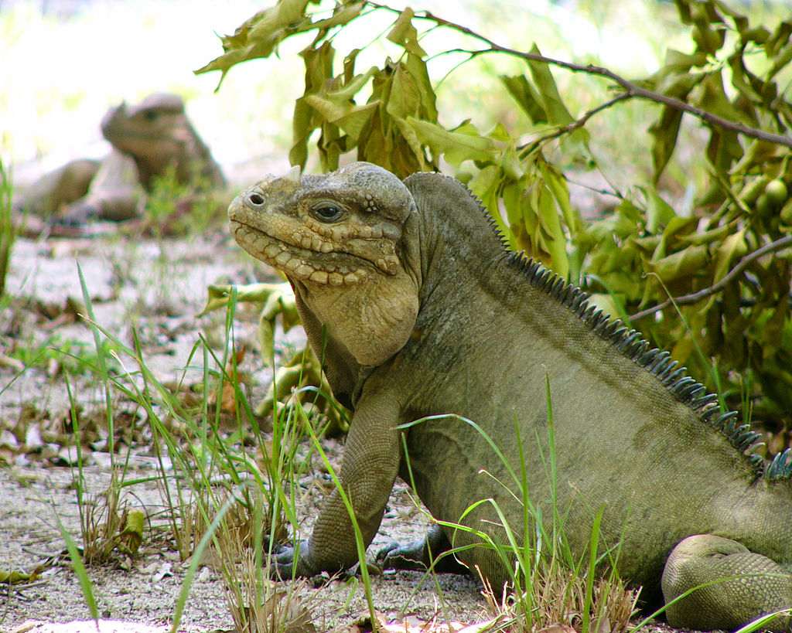
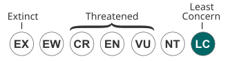
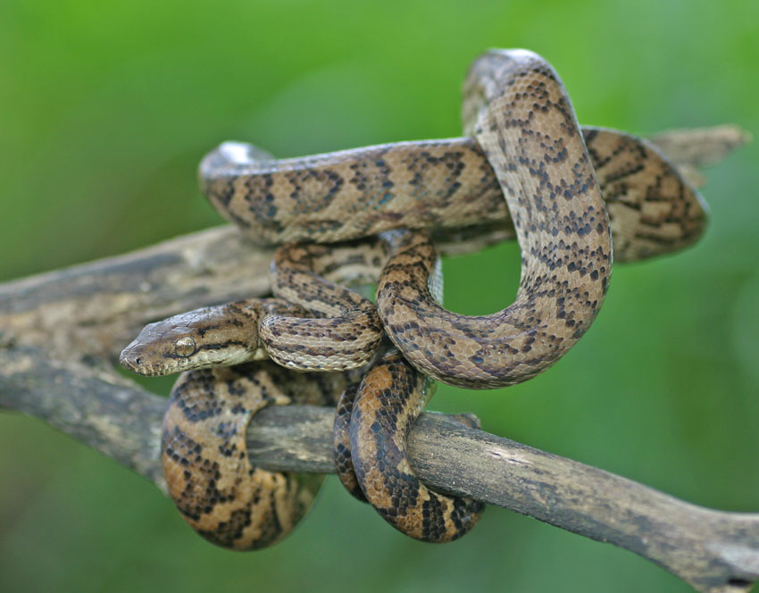
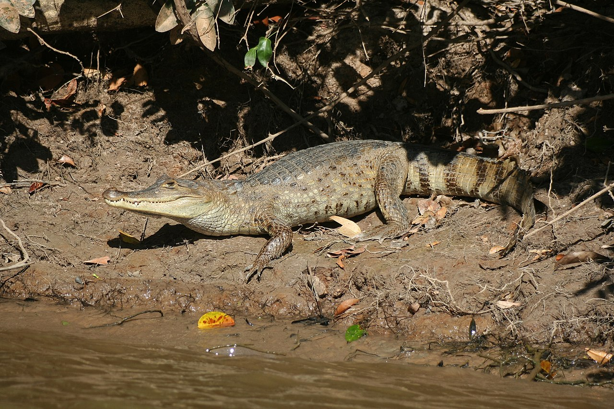
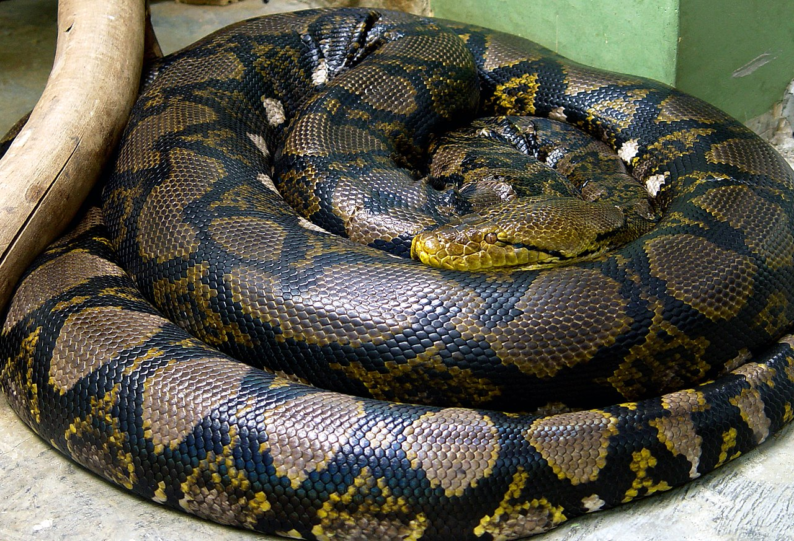

# Reptiles

## Turtles {.tabset}

### Salt Water

- Hawksbill Sea Turtle (<em>Eretmochelys imbricata</em>)

IUCN Rating:

The hawksbill sea turtle (Eretmochelys imbricata) is a critically endangered sea turtle belonging to the family Cheloniidae. It is the only extant species in the genus Eretmochelys. The species has a global distribution that is largely limited to tropical and subtropical marine and estuary ecosystems. 

In the Caribbean, the main nesting beaches are in the Lesser Antilles, Barbados, Guadeloupe, Tortuguero in Costa Rica, and the Yucatan. They feed in the waters off Cuba and around Mona Island near Puerto Rico, among other places. 

Throughout the world, hawksbill turtles have been hunted by humans, though it is illegal to capture, kill, and trade hawksbills in many countries today. In some parts of the world, hawksbill turtles and their eggs continue to be exploited as food. As far back as the fifth century BCE, sea turtles, including the hawksbill, were eaten as delicacies in China.

<video width="480" height="270" controls style=" margin: 0 0 20px 20px;">
  <source src="../media/turtvid.mp4" type="video/mp4">
  Your browser does not support the video tag.
</video>

- Leatherback Sea Turtle (<em>Dermochelys coriacea</em>)

Critically endangered!

### Fresh Water

- Puerto Rico Slider (<em>Trachemys stejnegeri stejnegeri</em>)

(more very fact-checked, relevant, and cool information that's not from Wikipedia)

 
 

## Lizards {.tabset}

### Geckos

- Monito Gecko (<em> Sphaerodactylus micropithecus </em>)
IUCN RAting:

The Monito gecko (Sphaerodactylus micropithecus) is a lizard, a species of gecko endemic to the island of Monito, in the archipelago of Puerto Rico.

Habitat & distribution
The Monito gecko is restricted to two locations on Monito: along the island's northwestern shelf over a sea cave, and an area along the northeastern edge in the vicinity of Castle Rock measuring approximately 500 by 300 meters, an area of 0.15 square kilometres (0.058 sq mi). It was discovered in May 1974 when a single adult and an egg were collected from the island of Monito. 

### Iguanas

- Mona Ground Iguana (<em>Cyclura stejnegeri</em>)

Critically Endangered!

(more very fact-checked, relevant, and cool information that's not from Wikipedia)

## Snakes {.tabset}

### Boas

- Puerto Rican Boa (<em>Epicrates inornatus</em>)

IUCN RAting:

The Puerto Rican boa (Chilabothrus inornatus) is a large species of boa endemic to Puerto Rico. It is a terrestrial snake with a dark brown coloration. It grows to 1.9 m (6.2 ft) in length. It feeds on small mammals such as rodents and bats, birds and sometimes anole lizards. Like most boas, it is viviparous (bearing live young) and kills its prey using constriction. 

Historic records, some dating back to the 18th century, indicate that during the first few centuries of Spanish colonization in Puerto Rico the boa was relatively abundant, and oil produced from the snake's fat was utilized extensively as an export (see snake oil). Impacts to the boa resulting from the oil trade were undoubtedly heightened by a concurrent reduction of habitat. Deforestation of the island began during this period and continued until, by the early 20th century, very little natural forest remained. Predation by the mongoose, introduced into Puerto Rico in the 19th century, has been postulated as a further cause for the boa's present status, but there is no direct evidence to support this idea. 

### Cobras

(more very fact-checked, relevant, and cool information that's not from Wikipedia)

### Vipers

(more very fact-checked, relevant, and cool information that's not from Wikipedia)

## Invasive Species {.tabset}

### Caimans

- Spectacled Caiman (<em>Caiman crocodilus</em>)

IUCN RAting:

The spectacled caiman (Caiman crocodilus), also known as the white caiman,[6] common caiman,[7] and speckled caiman,[8] is a crocodilian in the family Alligatoridae. It is brownish-, greenish-, or yellowish-gray colored and has a spectacle-like ridge between its eyes, which is where its common name come from. It grows to a length of 1.4–2.5 m (4 ft 7 in – 8 ft 2 in) and a weight of 7–40 kg (15–88 lb), with males being both longer and heavier than females. Its diet varies seasonally, commonly consisting of crabs, fish, small mammals, amphibians and snails. Breeding occurs from May to August and 14–40 eggs are laid in July and August. This crocodilian has a large range and population; it is native to much of Latin America, and has been introduced to the United States, Cuba, and Puerto Rico. 

### Pythons

- Reticulated Python (<em>Malayopython reticulatus</em>)

(more very fact-checked, relevant, and cool information that's not from Wikipedia)

Temporary fill text from Wikipedia

